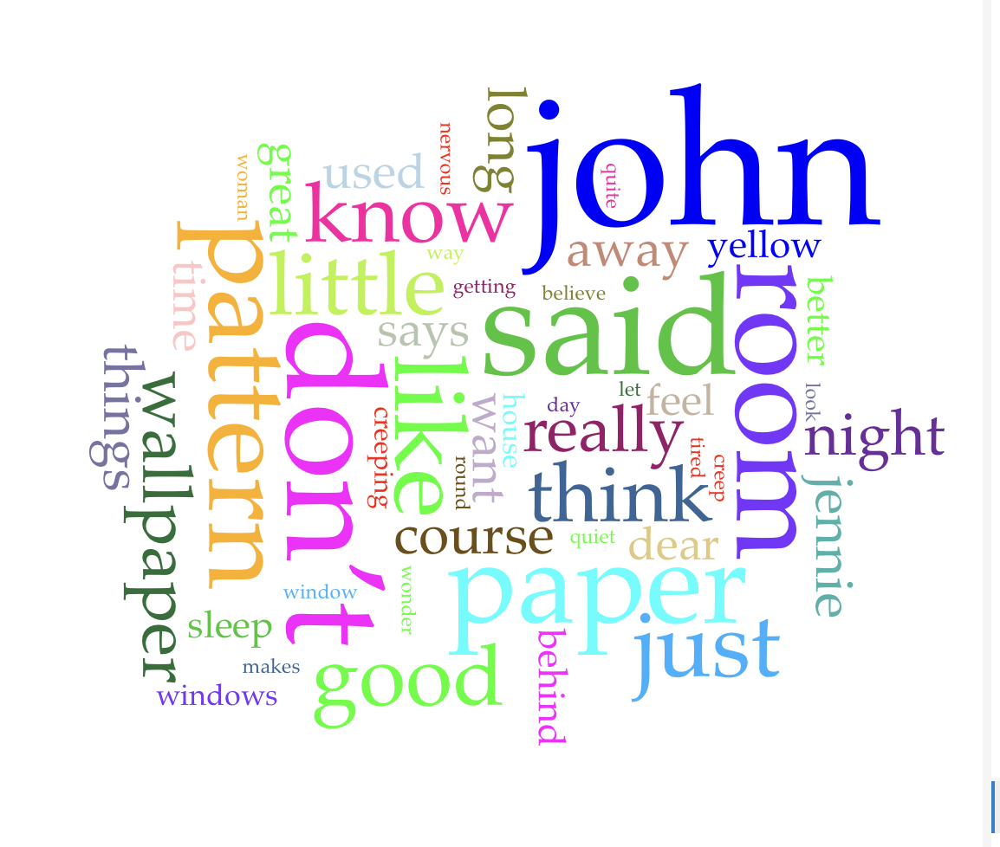

# Distant Reading Project

## Text Analyzed

For this project, I analyzed *The Yellow Wallpaper* by Charlotte Perkins Gilman using Voyant Tools and Microsoft Copilot.

## Voyant Analysis

Voyant helped me identify frequently used words and patterns throughout the story. The visualization made it easier to see which words appeared the most and how certain ideas were repeated throughout the text.

## Microsoft Copilot Analysis

I asked Microsoft Copilot questions about the themes, repeated words, and patterns found in *The Yellow Wallpaper*.
1. What are the main themes in this text?
2. What words or ideas appear repeatedly?

### Copilot Response 1

The main themes of The Yellow Wallpaper revolve around mental health, gender roles, freedom, and identity.

1. Mental Illness and Psychological Decline

The story traces the narrator's gradual breakdown. Although she believes she needs meaningful activity and intellectual stimulation, she is forced into isolation and inactivity. As a result, her fixation on the wallpaper grows until it consumes her sense of reality.

Key idea: Ignoring or misunderstanding mental health problems can worsen them.

2. Oppression of Women

The narrator has little control over her own life. Her husband John dismisses her opinions, makes decisions for her, and treats her more like a child than an equal partner.

Examples:

He forbids her to write.
He chooses her treatment.
He refuses to take her concerns seriously.

Key idea: The story criticizes the limited freedom and authority women had in the nineteenth century.

3. Freedom vs. Confinement

Physical confinement plays a major role in the story. The narrator is restricted to a room with barred windows and is discouraged from leaving or engaging with the outside world.

The woman she imagines trapped behind the wallpaper symbolizes a desire for freedom.

Key idea: People suffer when they are denied independence and self-expression.

4. The Power of Imagination and Creativity

Writing gives the narrator relief, but she must do it secretly. Her imagination, which could have been a healthy outlet, becomes focused entirely on the wallpaper because she has no other creative freedom.

Key idea: Creativity is an important part of personal well-being and identity.

5. Identity and Self-Discovery

As the story progresses, the narrator increasingly identifies with the woman behind the wallpaper. By the end, she believes she has become that woman and has escaped from behind the pattern.

Key idea: The narrator's struggle is a search for autonomy and a sense of self.

6. Appearance vs. Reality

John believes his wife is improving because she appears calm and obedient. In reality, her mental condition is deteriorating. Throughout the story, there is a growing gap between what others see and what the narrator experiences.

Key idea: External appearances can hide profound suffering.

Overall Theme

The central message of The Yellow Wallpaper is that suppressing a person's voice, independence, and creativity can be deeply damaging, especially when their experiences and emotions are ignored. The story serves as both a critique of the treatment of women and a powerful exploration of mental health.

### Copilot Response 2

Several words, images, and ideas recur throughout The Yellow Wallpaper. Their repetition helps reveal the narrator's growing obsession and deteriorating mental state.

Repeated Words and Images
1. The Wallpaper

The wallpaper is mentioned constantly and becomes the central focus of the story.

Its color ("yellow")
Its pattern
Its smell
The figure hidden behind it

As the story progresses, the wallpaper shifts from a simple decoration to a symbol of imprisonment and the narrator's psychological condition.

2. The Woman Behind the Wallpaper

The narrator repeatedly describes:

A shadowy woman
Creeping movements
Shaking the bars of the pattern
Trying to escape

This woman is widely interpreted as a reflection of the narrator herself and of other women restricted by society.

3. Creeping

The verb "creep" appears many times near the end of the story.

Examples:

The woman creeps behind the wallpaper.
The narrator sees women creeping outside.
The narrator herself begins creeping around the room.

The repetition emphasizes her identification with the trapped woman and her loss of connection with reality.

4. Writing

The narrator repeatedly mentions:

Wanting to write
Writing secretly
Being forbidden to write

Writing represents self-expression and independence. Its repeated appearance highlights what she is being denied.

5. Rest and Treatment

Words related to treatment occur frequently:

Rest
Sleep
Strength
Exercise
Nervousness
Self-control

These remind readers of John's "rest cure" and the medical approach that contributes to the narrator's decline.

Repeated Ideas
1. Confinement

The narrator repeatedly notices:

Barred windows
Locked doors
The nailed-down bed
Being restricted to the nursery

These details reinforce the theme of imprisonment.

2. John's Control

Throughout the story John:

Tells her what to do
Dismisses her opinions
Decides her treatment
Calls her pet names such as "little girl" and "little goose"

This repetition emphasizes the unequal power relationship in their marriage.

3. Freedom and Escape

The story repeatedly returns to the desire to:

Leave the room
Remove the wallpaper
Free the woman behind it
Escape confinement

By the end, these ideas dominate the narrator's thoughts.

Why Repetition Matters

The repetition mirrors the narrator's increasingly obsessive thinking. Just as she cannot stop looking at the wallpaper, readers cannot escape hearing about it. The recurring words and images show her narrowing focus and help illustrate her gradual descent into madness while highlighting the themes of oppression, confinement, mental illness, and the desire for freedom.

## Reflection

Using Voyant and Copilot enabled me to approach the analysis of *The Yellow Wallpaper* from a different perspective since this method is not limited to the traditional process of reading the text itself. Voyant was beneficial since it helped me discover recurring terms and patterns that would have been hard to identify while conducting a close reading of the text. Additionally, Copilot also helped me understand the meaning of particular patterns discovered while using Voyant. Yet, Voyant is unable to provide the necessary context to interpret certain terms found in the text while the data from Copilot has to be verified for accuracy. Through this exercise, I was able to conclude that distant reading may be considered an efficient method of identifying patterns in the text. Yet, such methods are most effective when used together with close reading and human interpretation.
